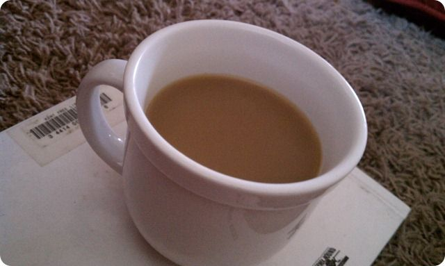

I think the only proper way to kick off a post about becoming a coffee snob is with a coffee related gripe. This is about Starbucks, but not about the cost--that dead horse had been beaten enough (and at a very reasonable $1.65 a cup, it's not even true around here). Instead, my complaint is about the business operations. 

Far too often I have gone to Starbucks and found that they were out of coffee. Out. Of. Coffee. How does that happen? It's the only thing they do! Here's a tip from someone who has no barista experience: when that seven gallon vat of coffee is getting low...start another vat. I'm actually surprised they don't have a machine our something that takes care of this automatically (maybe some do?). 

Anyway, it is only slightly for this reason that I prefer Dunkin. Dunkin is never out and the people are crazy friendly and fast, in my experience. More than that, I much prefer the flavor of Dunkin Donuts coffee. It's crazy good and smooth without any of the burned—sorry, “roasted”—taste of Starbucks.

The number one reason I’ve become a coffee snob is coffee’s role in my routine. It’s just one of those weird things that happens as you get older, I guess. As for why I need this constant, warm deliciousness in my daily routine, I credit my kids. They are much fun and offer daily surprises, which I offset by trying to make the most consistent, unsurprising batch of drink possible; a drink which *must* be enjoyed slowly as to avoid burning off one’s face.

That’s why I started drinking coffee, any way. The reason I’m a snob about it is that good coffee is much better than crap coffee, but is still cheap.

Notably absent from my reasons is caffeine. That difficult to spell compound has no perceptible effect on me and is of little use (to me) when struck with that 2:30 feeling. And yes, I have tested this by abstaining from coffee for many weeks at a time...

#### How To Make Coffee at Home

First off, you need good coffee. Coffee has a limited shelf life so don’t buy too much. Check the label carefully for the words “Folgers” and “Maxwell House”—these are indications of poor quality coffee. Buy it in a bag, too, not a can. For true connoisseurs, read up on [Alton Brown’s advice](http://www.foodnetwork.com/recipes/alton-brown/true-brew-recipe/index.html) and try to catch his *Good Eats* on the topic. I think most of his thoughts are pretty extreme, though, so I’ll present a much simplified version. 

Here’s what you’ll need: 

* a coffee maker and filters – nothing fancy; I use a simple $15 Mr. Coffee drip machine 
* coffee – again, nothing too fancy; I like pretty much any mild/medium roast and usually pay $6-8 per 12oz bag 
* kitchen scale – something with good precision (grams or hundredths of an ounce)  

I’m the only coffee drinker in the house so any numbers I toss out below are for one person; adjust yours accordingly.

#### Your First Pot

I usually put down two normal cups, which is equal to about four “Mr. Coffee” cups, so I fill the machine up to the “**4 cups**” line with water. 

Next, put a filter on your scale and tare it to zero. Fill it with what you normally use and note the mass. If you’re new to this and have no idea how much to use, start with **4 grams/cup** (16 grams in this case).

Brew your coffee (don’t steal a cup part way through—it only takes 3 minutes for crying out loud). 

Prepare a mug as you normally would or if you’re new here, add a splash or two of milk and a generous tablespoon of sugar (get ‘em started easy, I always say). Pour the drink and find something interesting or relaxing to do for 20 minutes while it cools enough for you to actually sip it.

#### Your Next Pot

How’d that first pot go? Too strong/weak? Think about what you’d like to change and do so next time by adjusting your numbers up or down by one or two grams/cup. If you feel compelled to go lower than 12 grams total, though, I’d suggest diluting the finished product with some water as suggested in the previously references [article](http://www.foodnetwork.com/recipes/alton-brown/true-brew-recipe/index.html):

> If you prefer a milder cup, brew to full strength, and then dilute with hot water. Brewing with too little coffee will result in over-extraction, and that means bitterness.

If you follow the dilution method, I suggest switching to tea (pansy) or adding the plain water to the carafe after the coffee maker is ready to go, but before you start brewing. This will help things mix and rise to a nice temperature.

#### Your Next Bag

After a few weeks you’ll run out of coffee. Buy a different variety next time to keep things interesting. Sarah always gets me something new, but nothing fancy, and the slight change every few weeks is great.

#### What About Organic/Fair Trade/Single Origin/Blah/Blah/Blah Coffee?

I honestly don’t know the first thing about any of that. My [resident hippie](http://footedjammies.blogspot.com/) buys coffee like a hippie so I guess I am passively endorsing some of those causes by drinking it, so there’s that. I suggest turning to Google for more info on those topics.

#### FAQ (i.e. Q&As I Made Up)

**I have a fancy {coffee, coffee maker, beaker, flask, magical gem, etc.} and it makes *way* better coffee?**

First off, that’s not a question—simply adding a question mark isn’t enough. Second, if that’s how you feel then *you* are actually a snob. This post’s title was meant to be a little bit of a joke because the only fancy thing I’m suggesting people do is buy a month’s worth of coffee for $8 instead of $5, and measure accurately so you can hone your product just to your liking. If you’ve moved up to the level where you can achieve satisfaction only with unnecessary gadgets and rare, expensive coffee, I grieve for you.

On the other hand, if that really was a question, then the answer is “no.”

**What coffee pot do you really use?**

A Mr. Coffee Drip Pot as pictured (that’s really mine, about to brew!). 

**What coffee do you really use?**

My current bag is “Archer Farms, Organic, Fair Trade, Super Nice Guy, Hippie Approved, Single Origin, Save the Children (seriously!?) Tierra Del Sol”. It’s from Target and costs like $6-$8. It’s just coffee. When this bag is gone, I’ll get another of a similar roast but a different variety.

</a>

**How do I get good coffee at work?**

Yikes, I have no idea. This is where that damn “snob” word comes up again. It’s hard to avoid the label when bringing in your own coffee to share or worse, using a private coffee maker. I’m open to ideas (leave a comment). This is probably why so many people buy coffee on their way *into* work.

**Do you really use a scale?**

Yes, every single time. I’m an engineer by trade so this won’t surprise anyone who knows me. I have found it to be the easiest way to make a consistent cup day after day. This is especially important as you are first figuring out how much coffee to use as it provides for simple, but precise adjustments.

**What about those K-Cup Thingamajigs?**

I have mixed feelings on that. They’re pretty wasteful in terms of energy and packaging. As far as flavor goes, they’re ok. I’d say they are much better than the typical Folgers junk but a noticeable step below the coffee I pictured above and significantly more expensive. One key advantage to this method is that you can mix it up so easily by trying different cups each time.

**Why is coffee so gross?**

It’s an acquired taste for sure. Here’s my estimate of a typical hater’s reasons:

**I’m making coffee for an actual coffee snob, what do I do?**

That’s actually pretty simple—just ask them to make it; they won’t mind. Or, if your friend is nice, ask them for honest feedback. They will invariably say that it should be stronger, or at least that’s been my experience. Hat-tip to the [nicest coffee expert](http://picturingtheordinary.blogspot.com/) I know.

**Umm Starbucks is way better than Dunkin.**

That’s incorrect but more importantly, irrelevant!

**You’re totally drinking coffee right now, aren’t you?**

Yes.

---

### 4 comments

**Sarah said on 2010-09-19**

Loved the post!  And I especially loved that one of your negatives for the K-Cup thingamajigs is that they're wasteful.  Maybe some of that hippie dirt I wear so well is rubbing off on you!

**Math Zombie said on 2010-09-19**

Ok, so this was a decent step back into the posting world. I hope it means there are more coming.

**picturingtheordinary said on 2010-09-20**

Awesome post! I must admit, I had a HORRIBLE cup of Dunkin last Sunday. I will definitely write up a full comment on my blog. --Sierra

**Michael Haren said on 2010-09-23**

I must share [this](http://theoatmeal.com/comics/coffee"), too

